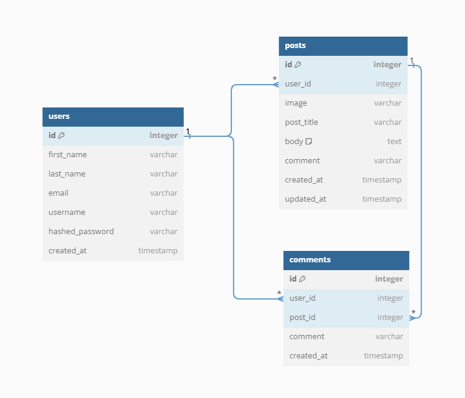
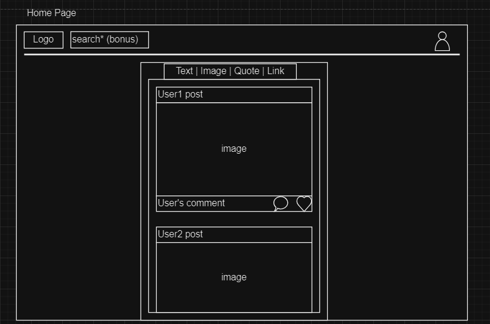
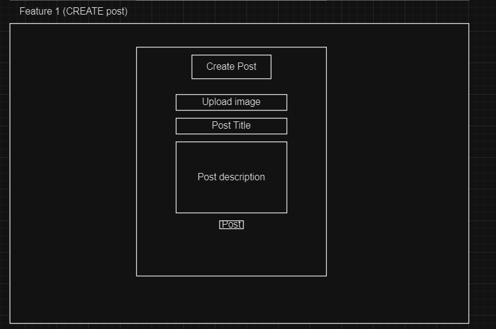

# Flask React Project

This is the starter for the Flask React project.

## Getting started

1. Clone this repository (only this branch).

2. Install dependencies.

   ```bash
   pipenv install -r requirements.txt
   ```

3. Create a __.env__ file based on the example with proper settings for your
   development environment.

4. Make sure the SQLite3 database connection URL is in the __.env__ file.

5. This starter organizes all tables inside the `flask_schema` schema, defined
   by the `SCHEMA` environment variable.  Replace the value for
   `SCHEMA` with a unique name, **making sure you use the snake_case
   convention.**

6. Get into your pipenv, migrate your database, seed your database, and run your
   Flask app:

   ```bash
   pipenv shell
   ```

   ```bash
   flask db upgrade
   ```

   ```bash
   flask seed all
   ```

   ```bash
   flask run
   ```

7. The React frontend has no styling applied. Copy the __.css__ files from your
   Authenticate Me project into the corresponding locations in the
   __react-vite__ folder to give your project a unique look.

8. To run the React frontend in development, `cd` into the __react-vite__
   directory and run `npm i` to install dependencies. Next, run `npm run build`
   to create the `dist` folder. The starter has modified the `npm run build`
   command to include the `--watch` flag. This flag will rebuild the __dist__
   folder whenever you change your code, keeping the production version up to
   date.

## Deployment through Render.com

First, recall that Vite is a development dependency, so it will not be used in
production. This means that you must already have the __dist__ folder located in
the root of your __react-vite__ folder when you push to GitHub. This __dist__
folder contains your React code and all necessary dependencies minified and
bundled into a smaller footprint, ready to be served from your Python API.

Begin deployment by running `npm run build` in your __react-vite__ folder and
pushing any changes to GitHub.

Refer to your Render.com deployment articles for more detailed instructions
about getting started with [Render.com], creating a production database, and
deployment debugging tips.

From the Render [Dashboard], click on the "New +" button in the navigation bar,
and click on "Web Service" to create the application that will be deployed.

Select that you want to "Build and deploy from a Git repository" and click
"Next". On the next page, find the name of the application repo you want to
deploy and click the "Connect" button to the right of the name.

Now you need to fill out the form to configure your app. Most of the setup will
be handled by the __Dockerfile__, but you do need to fill in a few fields.

Start by giving your application a name.

Make sure the Region is set to the location closest to you, the Branch is set to
"main", and Runtime is set to "Docker". You can leave the Root Directory field
blank. (By default, Render will run commands from the root directory.)

Select "Free" as your Instance Type.

### Add environment variables

In the development environment, you have been securing your environment
variables in a __.env__ file, which has been removed from source control (i.e.,
the file is gitignored). In this step, you will need to input the keys and
values for the environment variables you need for production into the Render
GUI.

Add the following keys and values in the Render GUI form:

- SECRET_KEY (click "Generate" to generate a secure secret for production)
- FLASK_ENV production
- FLASK_APP app
- SCHEMA (your unique schema name, in snake_case)

In a new tab, navigate to your dashboard and click on your Postgres database
instance.

Add the following keys and values:

- DATABASE_URL (copy value from the **External Database URL** field)

**Note:** Add any other keys and values that may be present in your local
__.env__ file. As you work to further develop your project, you may need to add
more environment variables to your local __.env__ file. Make sure you add these
environment variables to the Render GUI as well for the next deployment.

### Deploy

Now you are finally ready to deploy! Click "Create Web Service" to deploy your
project. The deployment process will likely take about 10-15 minutes if
everything works as expected. You can monitor the logs to see your Dockerfile
commands being executed and any errors that occur.

When deployment is complete, open your deployed site and check to see that you
have successfully deployed your Flask application to Render! You can find the
URL for your site just below the name of the Web Service at the top of the page.

**Note:** By default, Render will set Auto-Deploy for your project to true. This
setting will cause Render to re-deploy your application every time you push to
main, always keeping it up to date.

[Render.com]: https://render.com/
[Dashboard]: https://dashboard.render.com/

# Wiki Documentation

## MVP Feature List

### Posts
- Users should be able to view all posts.
- Users should be able to create posts.
- Users should be able to update their posts.
- Users should be able to delete their posts.
### Comments
- Users should be able to view all comments on a post.
- Users should be able to create a comment on a post.
- Users should be able to update their comment on a post.
- Users should be able to delete their comment from a post.

### Likes
- Users should be able to view the likes on a post.
- Users should be able to like a post.
- Users should be able to unlike a post.
### Follows
- Users should be able to view who they follow.
- Users should be able to follow another user.
- Users should be able to unfollow another user.

## Database Schema (two main features for now)


# User Stories


## Users
### Sign Up
- As an unregistered and unauthorized user, I want to be able to sign up for the website via a sign-up form.
 - When I'm on the /signup page:
 I would like to be able to enter my email, username, and preferred password on a clearly laid out form.
- I would like the website to log me in upon successful completion of the sign-up form.
So that I can seamlessly access the site's functionality
- When I enter invalid data on the sign-up form:
I would like the website to inform me of the validations I failed to pass, and repopulate the form with my valid entries (except my password).
So that I can try again without needing to refill forms I entered valid data into.

### Log in
- As a registered and unauthorized user, I want to be able to log in to the website via a log-in form.
- When I'm on the /login page:
I would like to be able to enter my email and password on a clearly laid out form.
I would like the website to log me in upon successful completion of the lob-up form.
So that I can seamlessly access the site's functionality
- When I enter invalid data on the log-up form:
I would like the website to inform me of the validations I failed to pass, and repopulate the form with my valid entries (except my password).
So that I can try again without needing to refill forms I entered valid data into.
### Demo User
- As an unregistered and unauthorized user, I would like an easy to find and clear button on both the /signup and /login pages to allow me to visit the site as a guest without signing up or logging in.
- When I'm on either the /signup or /login pages:
I can click on a Demo User button to log me in and allow me access as a normal user.
So that I can test the site's features and functionality without needing to stop and enter credentials.
### Log Out
- As a logged in user, I want to log out via an easy to find log out button on the navigation bar.
While on any page of the site:
I can log out of my account and be redirected to a page displaying recent Posts.
So that I can easily log out to keep my information secure.
### Posts
Create Posts
- As a logged in user, I want to be able to post new Posts.
- When I'm on the /new-post page:
I can write and submit a new Post.
So that I can share my thoughts and memes with my friends.
Viewing Posts
- As a logged in or logged out user, I want to be able to view a selection of the most recent Posts.
- When I'm on the /posts page:
I can view the ten most recently posted Posts.
So that I can read and interact with the thoughts and memes of my friends.
As a logged in or logged out user, I want to be able to view a specific Post and its associated comments and likes.
- When I'm on the /posts/:id page:
I can view the content of the posts, as well as the associated comments and likes.
So that I can read and interact with the thoughts and memes of my friends, and add my own thoughts and memes in the comments.

Updating Posts
- As a logged in user, I want to be able to edit my Posts by clicking an Edit button associated with the Post anywhere that Post appears.
When I'm on the /posts, /posts/:id, or /users/:id/posts pages:
I can click "Edit" to make permanent changes to Posts I have posted.
So that I can fix any errors I make in my Posts.

Deleting Posts
- As a logged in user, I want to be able to delete my Posts by clicking a Delete button associated with the Post anywhere that Post appears.
When I'm on the /Posts, /Posts/:id, or /users/:id/Posts pages:
I can click "Delete" to permanently delete a Post I have posted.
So that when I realize I shouldn't have publicly said something, I can easily remove it.
### Comments
Create Comments
- As a logged in user, I want to be able to post new comments.
When I'm on the /posts page:
I should be able to click on the "create comment" button.
I can write and submit a new comment on a Post.
So that I can share my comments with my friends about that Post.

Viewing Comments
- As a logged in or logged out user, I want to be able to view a selection of the most recent comments on a Post.
- When I'm on the /posts page:
I can view the ten most recently posted comments.
So that I can read and interact with the thoughts and memes of my friends.

Updating Comments
- As a logged in user, I want to be able to edit my comments by clicking an Edit button associated with the Post.
When I'm on the /posts/:id, or /users/:id/posts pages:
I can click "Edit" to make permanent changes to comments that I have posted.
So that I can fix any errors I make in my comments.

Deleting Comments
- As a logged in user, I want to be able to delete my comments by clicking a Delete button associated with the Post.
When I'm on the /posts/:id, or /users/:id/posts pages:
I can click "X" to permanently delete a comment I have posted.

# Wireframes 





